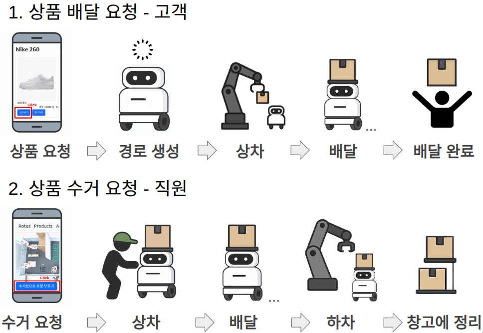
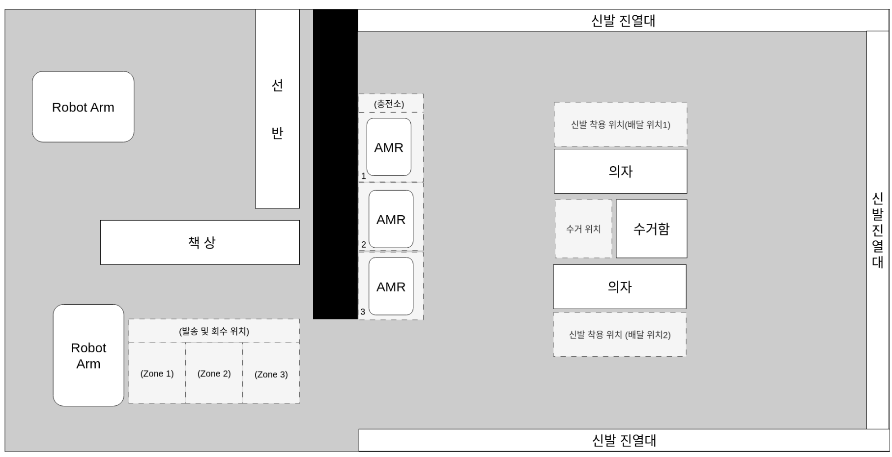
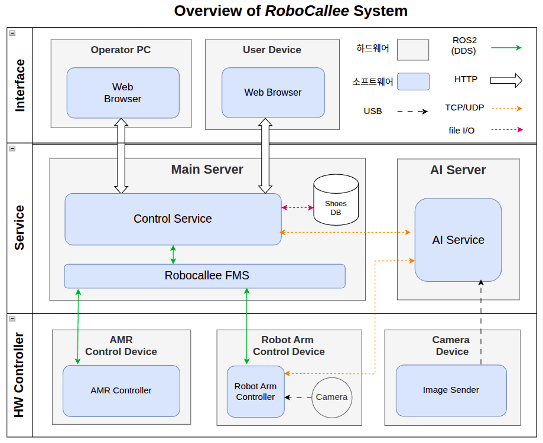
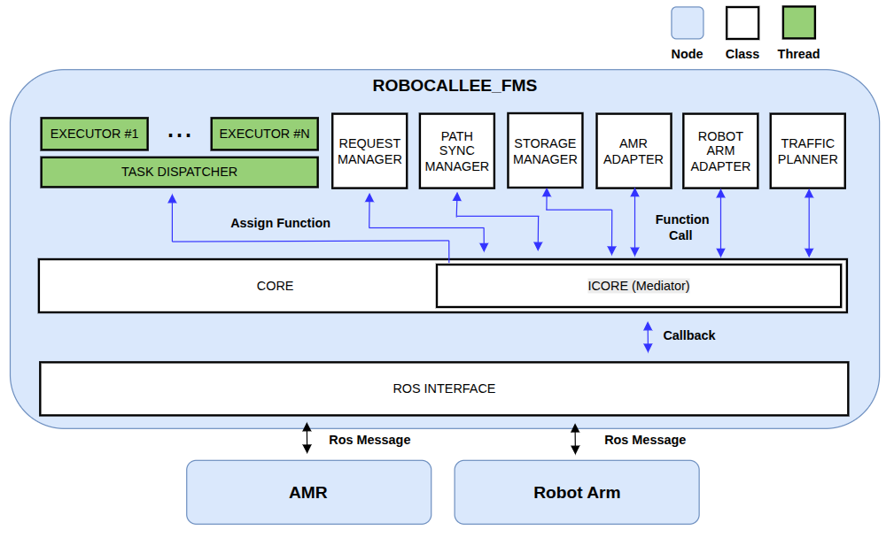
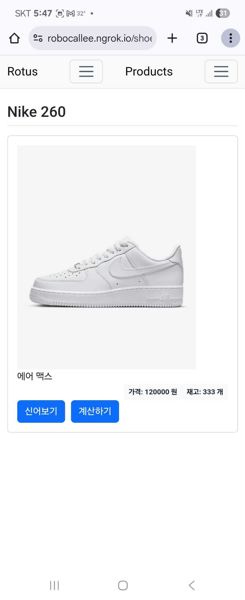
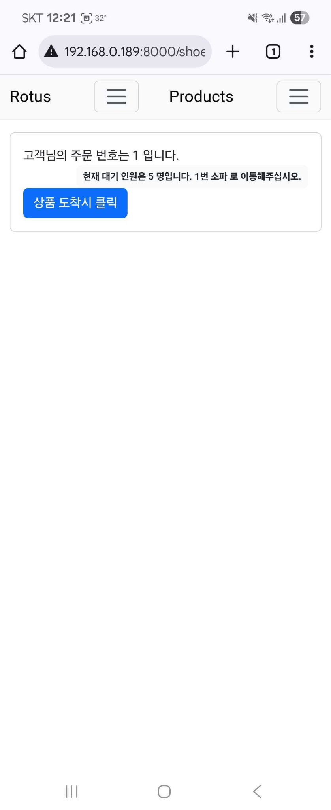
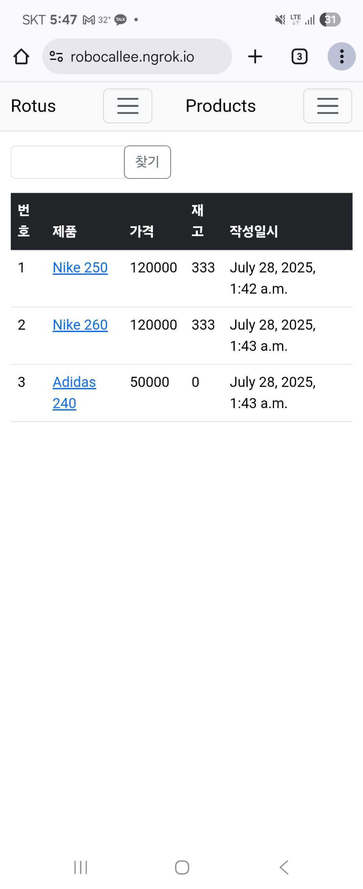
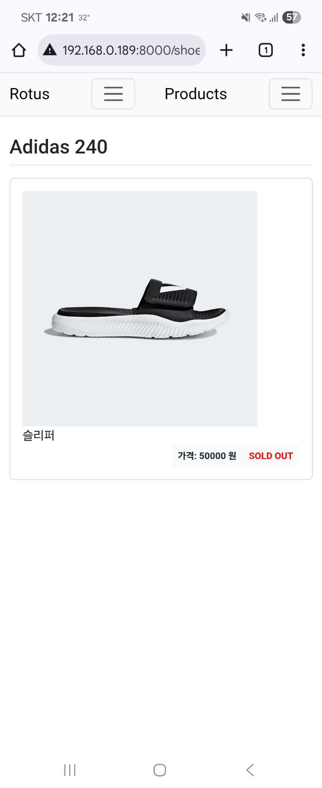
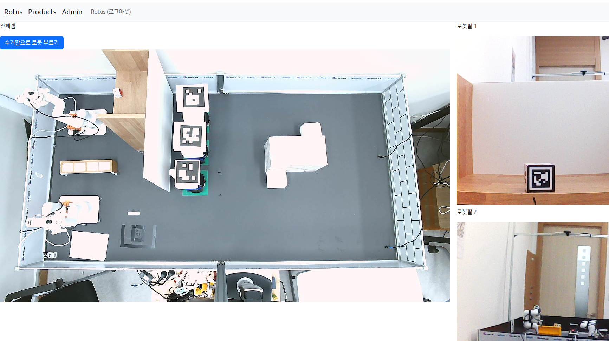
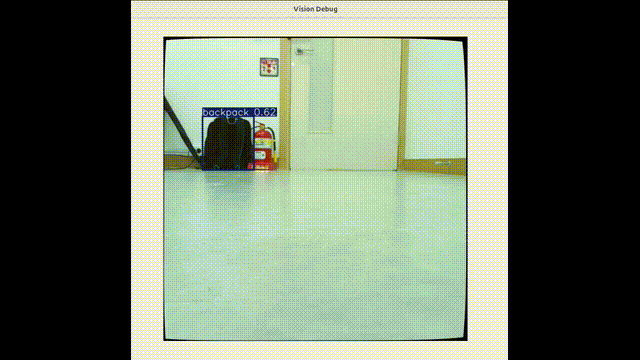

# RoboCallee (Robot + Callee)

  

---

## 1. 프로젝트 개요

스마트 매장에서 **로봇팔 + 자율 주행 로봇**을 활용해 신발 재고 운반과 고객 응대를 자동화하는 프로젝트입니다.  
고객 편의성 증대와 매장 운영 효율화를 동시에 달성하는 **로봇 기반 스마트 스토어**를 목표로 합니다.

### 프로젝트 수행 시나리오

### Map 구성

---

## 2. Git 폴더 구조

---

## 3. SW 아키텍처

---

## 4. FMS (Fleet Management System)

### FMS SW 아키텍처

### 시나리오 수행 영상
|  |  |  |
|:----------------------------------------------------------------------------------------------------------------:|:----------------------------------------------------------------------------------------------------------------:|:----------------------------------------------------------------------------------------------------------------:|
| FMS 배달 시나리오 | FMS 수거 시나리오 | FMS 수거 시나리오 GUI 요청 |

---

## 5. Control Service

### User GUI
|  |  |  |  |
|---------------------------------------------|---------------------------------------------|---------------------------------------------|---------------------------------------------|

### Admin GUI

#### Web GUI

#### QT GUI

---

## 6. 로봇팔 제어

### 로봇팔 수행
|  |  |  |  |
|:--------------------------------------------:|:--------------------------------------------:|:--------------------------------------------:|:--------------------------------------------:|
| Shelf → Buffer                               | Buffer → Robot                               | Robot → Buffer                               | Buffer → Shelf                               |

### OCR

 
---

## 7. 자율 주행 로봇
### PID 제어

### 강화학습 주행 (DQN)

### Vision 기반 주행

#### vision tracker
|  |  |
|:--------------------------------------------:|:--------------------------------------------:|
| vision tracker                               | 로봇 시야                                    |

#### Obstacle avoidance
|  |  |
|:--------------------------------------------:|:--------------------------------------------:|
| 장애물 회피                               | 로봇 시야                                    |

---
