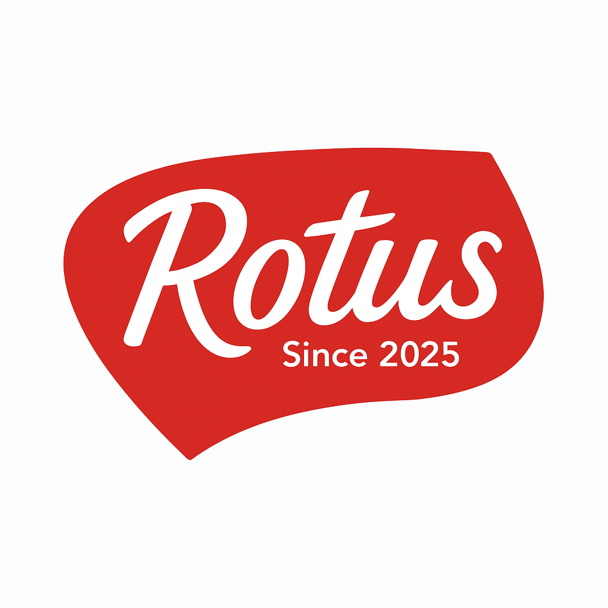
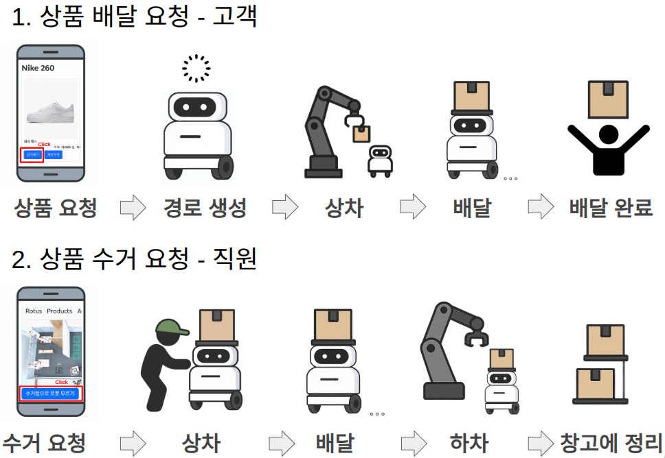
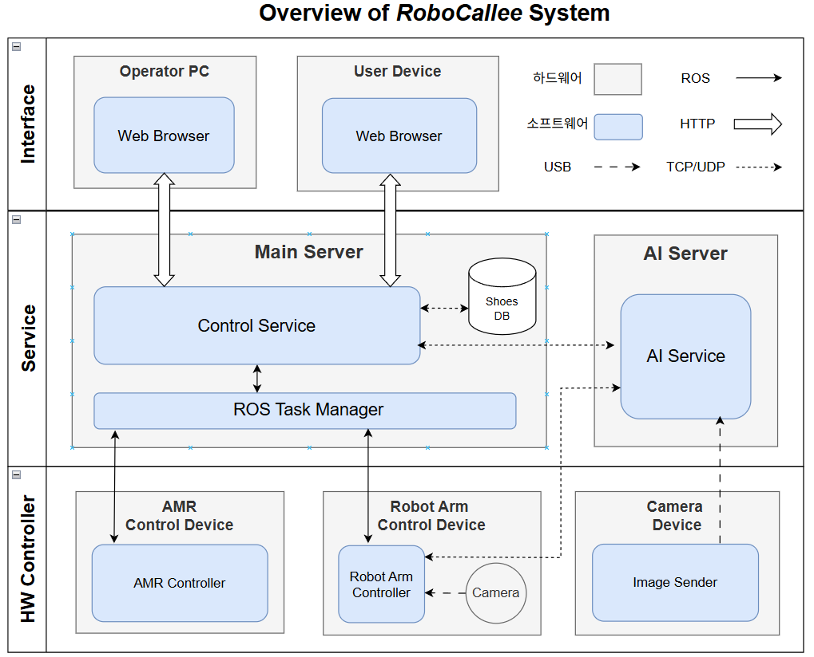
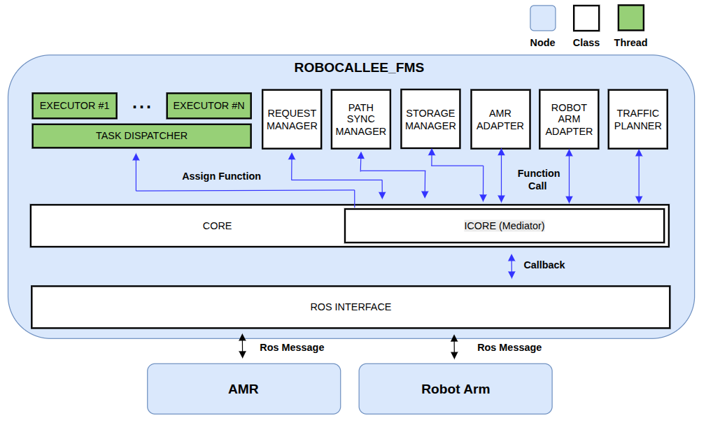
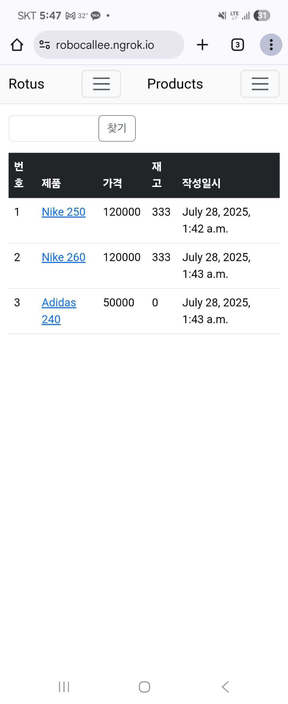
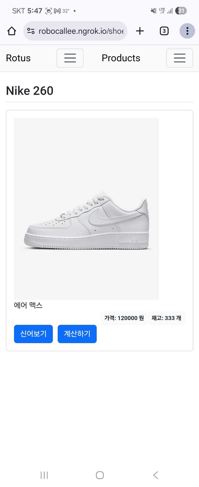
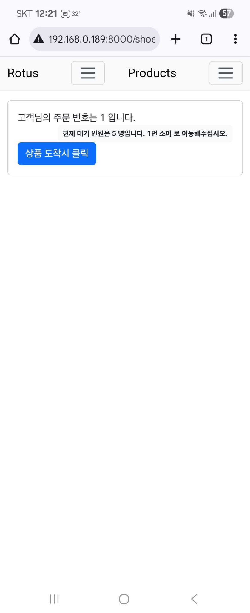
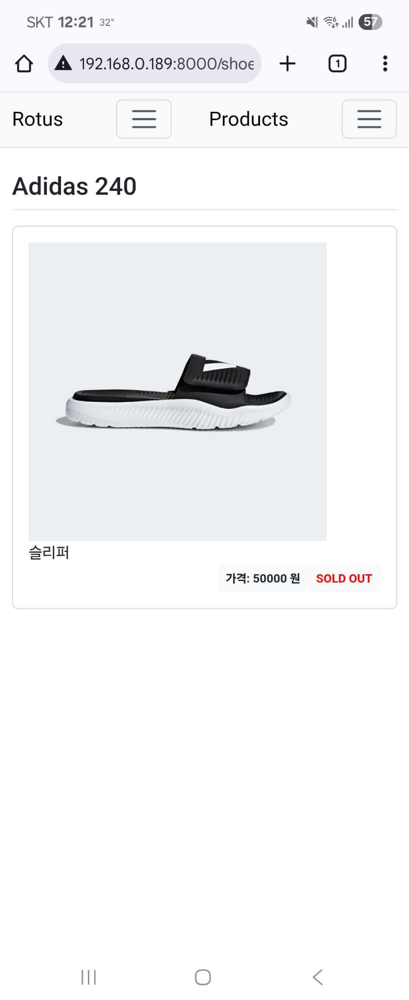
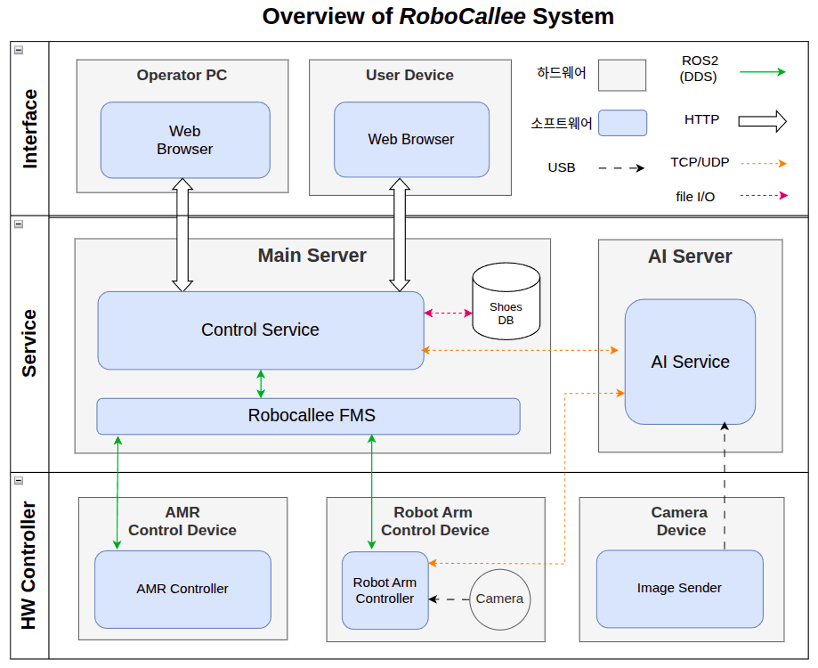
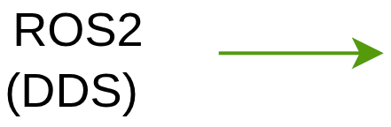

# RoboCallee (Robot + Callee)

  

---

## 1. 프로젝트 개요

스마트 매장에서 **로봇팔 + 자율 주행 로봇**을 활용해 신발 재고 운반과 고객 응대를 자동화하는 프로젝트입니다.  
고객 편의성 증대와 매장 운영 효율화를 동시에 달성하는 **로봇 기반 스마트 스토어**를 목표로 합니다.

### 프로젝트 수행 시나리오

---

## 2. SW 아키텍처

---

## 3. FMS (Fleet Management System)
### FMS SW 아키텍처

### 시나리오 수행 영상

|  | |
|---------------------------------------------|---------------------------------------------|

---

## 4. Control Service

### GUI 구성
|  |  |  |  |
|---------------------------------------------|---------------------------------------------|---------------------------------------------|---------------------------------------------|

---

## 5. 로봇팔 제어

### OCR
|  |  |  |  |
|---------------------------------------------|---------------------------------------------|---------------------------------------------|---------------------------------------------|

### OCR

 
---

## 6. 자율 주행 로봇
### PID 제어

### 강화학습 주행 (DQN)

### Vision 기반 주행
  

---
