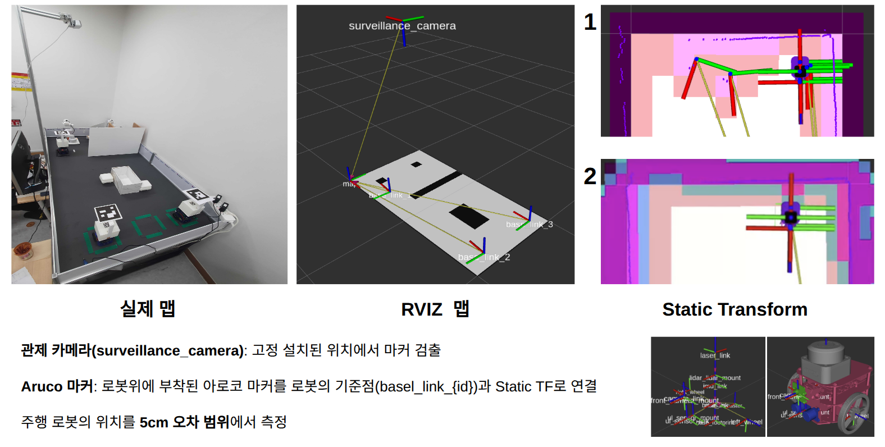
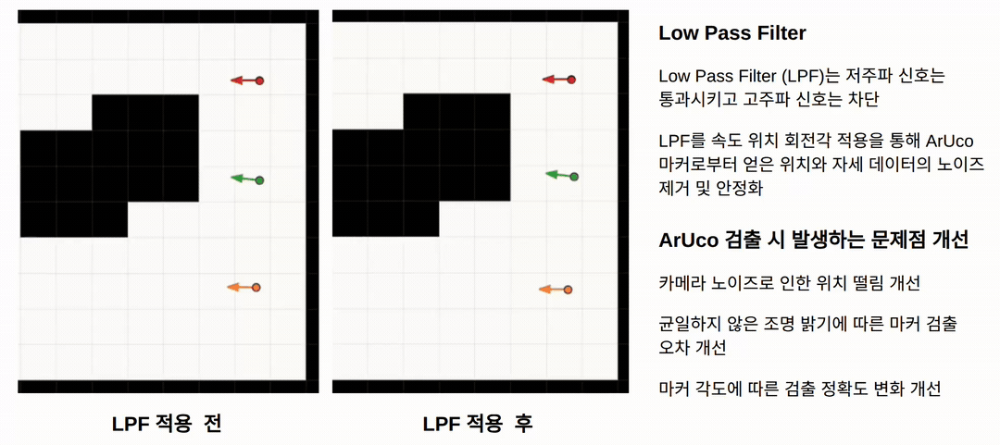
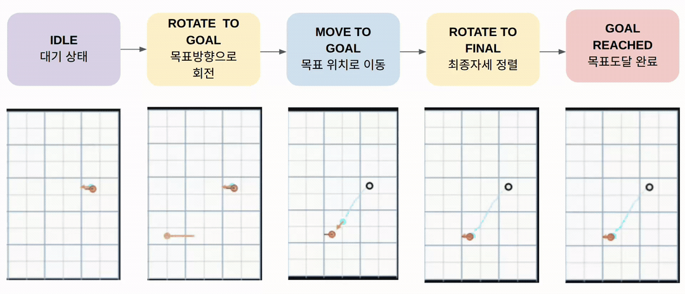
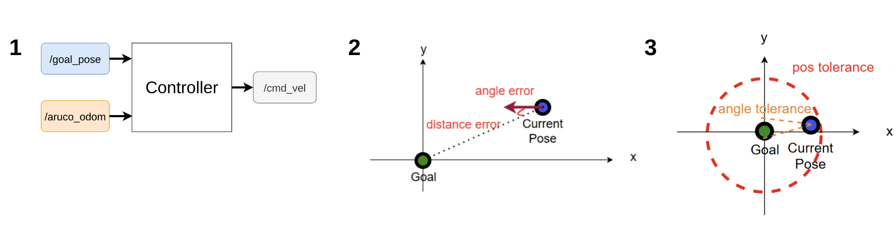
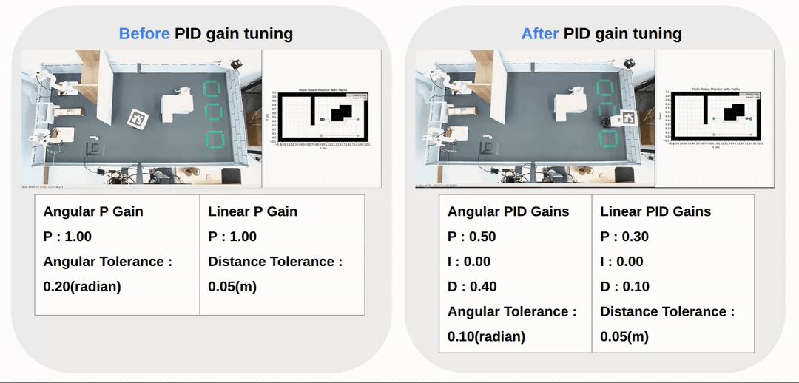
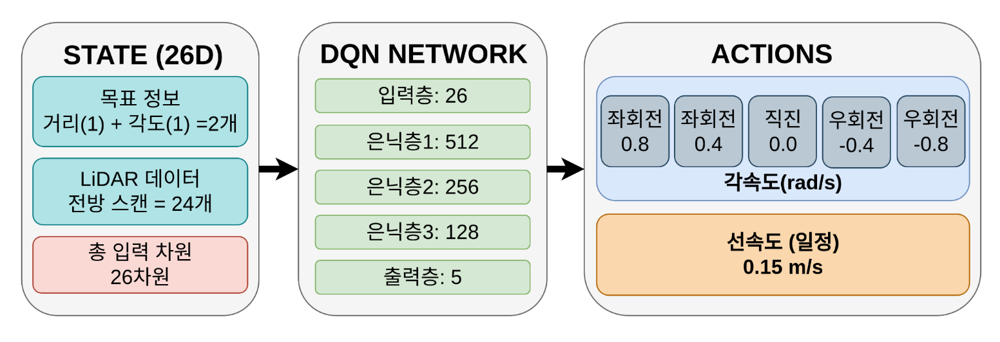

# RoboCallee (Robot + Callee)
<p align="center">
  
</p>

---

## 1. 프로젝트 개요

스마트 매장에서 **로봇팔 + 자율 주행 로봇**을 활용해 신발 재고 운반과 고객 응대를 자동화하는 프로젝트입니다.  
고객 편의성 증대와 매장 운영 효율화를 동시에 달성하는 **로봇 기반 스마트 스토어**를 목표로 합니다.

### ● 프로젝트 수행 시나리오


### ● Map 구성


---

## 2. Git 폴더 구조

```
roscamp-repo-3/
├── docs/
│   └── images/
├── HW_Controller/
│   ├── DomainBridge/
│   ├── Location Manger_GUI/
│   │   ├── aruco_interfaces/msg
│   │   └── aruco_marker_pkg/...
│   ├── Mobile_Robot_Controller/pid_controller_node/...
│   └── Robot_Arm_Controller/ros2_mycobot_pick_and_place/src/...
├── Service/
│   ├── .vscode/
│   ├── Control_Service/RoboCallee_Server/{common, config, media, static, templates...}
│   ├── Lib/{opencv_r, YAML...}
│   ├── Robocallee_PickBot/{Core, ImageProcessing, Interface, RobotArm...}
│   ├── ROS_Task_Manager/robocallee_fms/{Adapters, Core, Manager, Task, Traffic...}
│   └── Utile/{Common, Logger}
└── Technology_Survey/robotCamtoArm/{Calib, Calib_Image, include, src}
```

---

## 3. SW 아키텍처


---

## 4. FMS (Fleet Management System)

### ● FMS SW 아키텍처


### ● 시나리오 수행 영상
| [](https://www.youtube.com/watch?v=GBW1qsYFHe4) | [](https://www.youtube.com/watch?v=zXWMFyJrSFo) | [](https://www.youtube.com/watch?v=mT-UyDo27II) |
|:----------------------------------------------------------------------------------------------------------------:|:----------------------------------------------------------------------------------------------------------------:|:----------------------------------------------------------------------------------------------------------------:|
| FMS 배달 시나리오 | FMS 수거 GUI 시나리오 | FMS 수거 시나리오 |

---

## 5. Control Service

### ● User GUI
|  |  |  |  |
|---------------------------------------------|---------------------------------------------|---------------------------------------------|---------------------------------------------|

### ● Admin GUI

#### □ Web GUI


#### □ QT GUI


---

## 6. 로봇팔 제어

### ● 로봇팔 수행
|  |  |  |  |
|:--------------------------------------------:|:--------------------------------------------:|:--------------------------------------------:|:--------------------------------------------:|
| Shelf → Buffer                               | Buffer → Robot                               | Robot → Buffer                               | Buffer → Shelf                               |

### ● OCR

 
---

## 7. 자율 주행 로봇
### ● Aruco marker Localization

* Aruco marker localization LPF

### ● Navigation State Machine

### ● PID 제어



### ● 강화학습 주행 (DQN)

#### □ Sim2Real
|  |  |
|:--------------------------------------------:|:--------------------------------------------:|
| DQN Navigation                               | DQN collision avoidance                      |
### ● Vision 기반 주행

#### □ vision tracker
|  |  |
|:--------------------------------------------:|:--------------------------------------------:|
| vision tracker                               | 로봇 시야                                      |

#### □ Obstacle avoidance
|  |  |
|:--------------------------------------------:|:--------------------------------------------:|
| 장애물 회피                               | 로봇 시야                                    |

---
